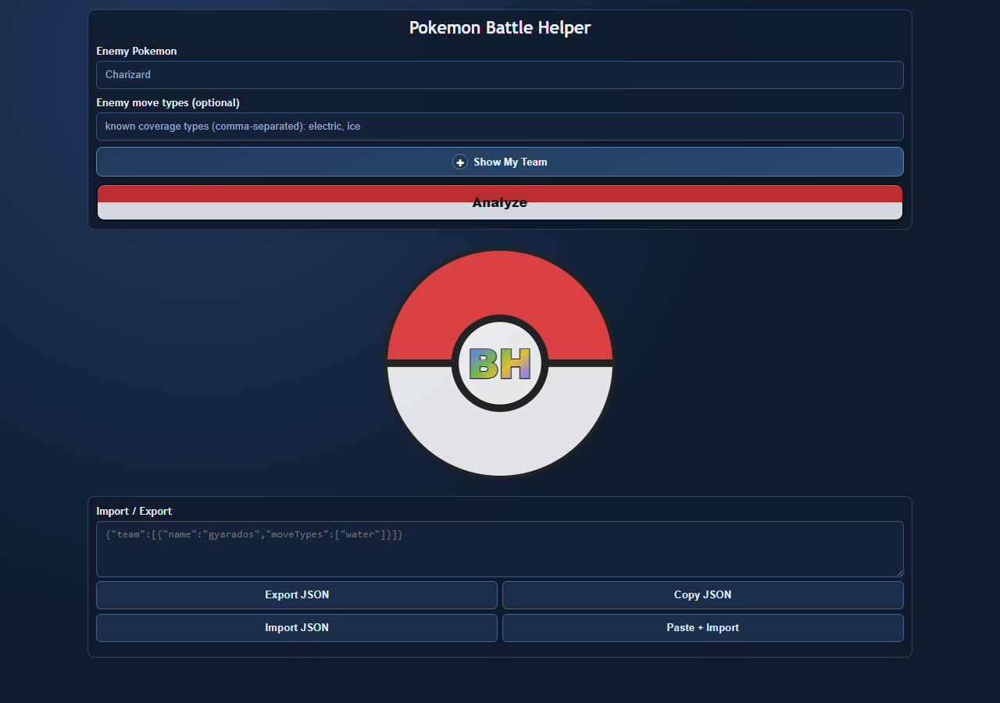
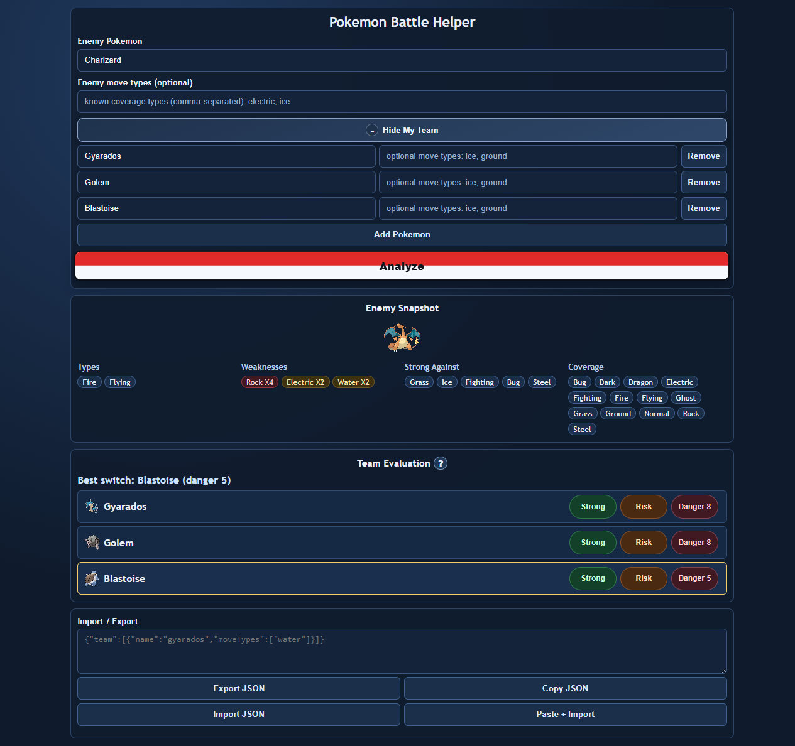

# Pokemon Battle Helper

Pokemon Battle Helper is a fast, local-first battle assistant built with React + Vite + TypeScript.
It helps you decide the best switch against an enemy Pokemon by combining:

- Enemy type weaknesses
- Enemy offensive coverage pressure
- Team offensive and defensive matchup labels
- Danger score and best-switch recommendation
- Optional move-type hints (TM-style coverage) for both your team and the enemy

The project roadmap is complete through Tier 13.

## Core Features

- Enemy snapshot with:
  - Enemy types
  - Weakness list with multipliers
  - Strong-against type list
  - Coverage types
  - Enemy sprite
- Team evaluation per Pokemon with:
  - Strong / Neutral / Weak
  - Safe / Risk
  - Danger score
  - Inline explanations (clickable labels)
- Move coverage integration:
  - Optional team move types
  - Optional enemy move types
  - STAB vs TM explanation clarity
- Coverage mode switching:
  - Known enemy moves mode when enemy move types are provided
  - Assumed coverage mode otherwise
- Best switch recommendation highlight
- Team persistence in localStorage
- Import / Export team JSON with clipboard actions
- Fast local autocomplete for:
  - Enemy Pokemon
  - Team Pokemon
  - Optional move-type inputs
- IndexedDB + localStorage caching for faster repeated usage

## Tech Stack

- React
- Vite
- TypeScript
- PokeAPI
- IndexedDB (Pokemon/type cache)
- localStorage (team and Pokemon name index)
- Vitest (battle logic tests)

## Getting Started

### Requirements

- Node.js 20+
- npm

### Install

```bash
npm install
```

### Run in development

```bash
npm run dev
```

### Build

```bash
npm run build
```

### Preview production build

```bash
npm run preview
```

### Lint

```bash
npm run lint
```

### Test

```bash
npm run test
```

### Deploy (GitHub Pages)

```bash
npm run deploy
```

## Screenshots

### Initial State



### Full Analysis with Team



## Team Import / Export Format

Current team transfer payload:

```json
{
  "team": [
    {
      "name": "gyarados",
      "moveTypes": ["ice", "ground"]
    },
    {
      "name": "blastoise",
      "moveTypes": []
    }
  ]
}
```

Notes:

- Names and types are normalized to lowercase.
- Invalid move types are ignored.
- Legacy array-only team imports are still supported.

## Architecture

Layering follows the roadmap constraints:

- UI: React components in src/App.tsx
- Battle engine: pure TypeScript logic in src/battle
- Data layer: PokeAPI + cache in src/data/pokeapi.ts

Business rules are kept out of the UI and tested in battle engine tests.

## Project Structure

```text
src/
  App.tsx
  battle/
    advancedAnalysis.ts
    coverage.ts
    pokemonAutocomplete.ts
    teamEvaluation.ts
    teamTransfer.ts
    typeEffectiveness.ts
  data/
    pokeapi.ts
```

## Testing Scope

The test suite is focused on pure battle logic functions (no UI tests), including:

- Type effectiveness
- Enemy coverage extraction/filtering
- Team evaluation
- Advanced analysis and danger scoring
- Team transfer parsing/validation
- Autocomplete filtering/ranking

## Out of Scope

This is intentionally not a competitive simulator. It does not include:

- Abilities
- IV/EV stats
- Damage calculations
- Full move learnset simulation
- Backend services or auth

## Data Source

- PokeAPI: https://pokeapi.co/
